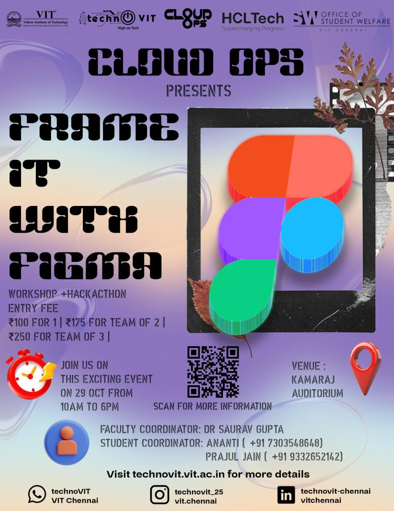

# ANIMATHON

### Helpful Information

<table data-view="cards"><thead><tr><th></th><th></th></tr></thead><tbody><tr><td><strong>📅 Date</strong></td><td>1st November – 2nd November</td></tr><tr><td><strong>⏱ Duration / Time</strong></td><td>10:00 AM (1st Nov) – 1:30 PM (2nd Nov) (26+ Hours)</td></tr><tr><td><strong>📍 Venue</strong></td><td>VOC AUDITORIUM</td></tr><tr><td><strong>👤 Organiser</strong></td><td>ANIMATION CLUB</td></tr><tr><td><strong>🅰️ Type</strong></td><td>Animation Marathon</td></tr></tbody></table>

### Event Details

🎬✨ For the first time in the history of VIT Chennai, the Animation Club proudly unveils **ANIMATHON!** ✨🎨

**Where Creativity Meets Reality**

Embark on an extraordinary journey where imagination transcends boundaries and creativity finds form. Experience over **26+ hours of epic animation magic!** — an enthralling blend of innovation, collaboration, and artistic expression.

✨ Learn. Create. Compete. Inspire. Unleash the full force of your creativity and let your art breathe life into the world of animation. 🖋️🔥

<table data-card-size="large" data-view="cards" data-full-width="false"><thead><tr><th></th><th>Fees &#x26; Team Size</th><th></th><th></th><th data-hidden data-card-cover data-type="image">Cover image</th></tr></thead><tbody><tr><td><h4>Register Now</h4></td><td><ul><li><strong>₹300</strong> (Team Size 3-4)</li><li><strong>₹500</strong> (Team Size 5-6)</li></ul></td><td><em>This event follows the unified registration flow provided by VIT Chennai. It allows participants from inside VIT and outside VIT too!</em></td><td><a href="https://chennaievents.vit.ac.in/technovit/" class="button primary" data-icon="rocket-launch">Register</a></td><td><a href="https://images.unsplash.com/photo-1607000975574-0b425df6975a?crop=entropy&#x26;cs=srgb&#x26;fm=jpg&#x26;ixid=M3wxOTcwMjR8MHwxfHNlYXJjaHwxfHxnbyUyMGZvciUyMGl0fGVufDB8fHx8MTc2MTMwMTA2N3ww&#x26;ixlib=rb-4.1.0&#x26;q=85">https://images.unsplash.com/photo-1607000975574-0b425df6975a?crop=entropy&#x26;cs=srgb&#x26;fm=jpg&#x26;ixid=M3wxOTcwMjR8MHwxfHNlYXJjaHwxfHxnbyUyMGZvciUyMGl0fGVufDB8fHx8MTc2MTMwMTA2N3ww&#x26;ixlib=rb-4.1.0&#x26;q=85</a></td></tr></tbody></table>

### Organising Committee Information

#### Student Coordinators

<table data-card-size="large" data-view="cards"><thead><tr><th>Name</th><th>Phone</th><th></th></tr></thead><tbody><tr><td>Aathira</td><td>7397433098</td><td><a href="tel:7397433098" class="button secondary">Call Now</a></td></tr><tr><td>Aditi</td><td>8688092542</td><td><a href="tel:8688092542" class="button secondary">Call Now</a></td></tr></tbody></table>



<figure><figcaption></figcaption></figure>



#### Announcements

Stay connected for all announcements, clarifications, and event updates. Join the Official WhatsApp Group:

<a href="https://chat.whatsapp.com/CfuNvUPk7PsIptfDeSjKcQ?mode=wwc" class="button primary" data-icon="bullhorn">Join the channel!</a>



***

### POSTER

<figure><figcaption></figcaption></figure>


#### Auto-generated Page

This page was auto-generated by processing the event poster and its accompanying description.

