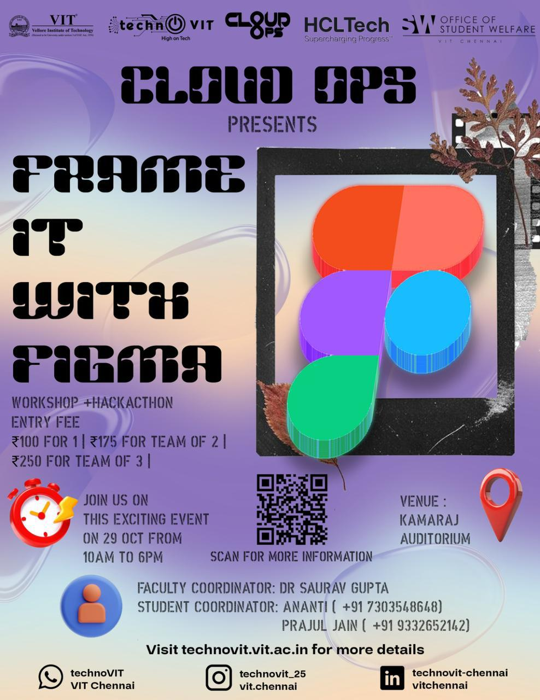

# ALLOYZ

### Helpful Information

<table data-view="cards"><thead><tr><th></th><th></th></tr></thead><tbody><tr><td><strong>📅 Date</strong></td><td>31.10.25</td></tr><tr><td><strong>⏱ Duration / Time</strong></td><td>10 AM - 3 PM</td></tr><tr><td><strong>📍 Venue</strong></td><td>AB1 - 306</td></tr><tr><td><strong>👤 Organiser</strong></td><td>Havoltz Club</td></tr><tr><td><strong>🅰️ Type</strong></td><td>A Full Hands-On Soldering Workshop</td></tr></tbody></table>

### Event Details

🔥 **Alloyz : A Full Hands-On Soldering Workshop!** 🔥

Get ready to learn the art of soldering from scratch in a practical, interactive session. Perfect for anyone interested in electronics or DIY hardware projects!💡⚙️

🎯 Don’t miss this opportunity to gain hands-on experience and create real circuits yourself!

⚠️ **LIMITED SEATS!**



#### Register Now

**Fees**:

* **FEE - RS. 80**

_This event follows the unified registration flow provided by VIT Chennai. It allows participants from inside VIT and outside VIT too!_

<a href="https://chennaievents.vit.ac.in/technovit/" class="button primary" data-icon="rocket-launch">Register</a>



<figure><figcaption></figcaption></figure>



### Organising Committee Information

#### Student Coordinators

<table data-card-size="large" data-view="cards"><thead><tr><th>Name</th><th data-type="number">Phone</th><th></th></tr></thead><tbody><tr><td>TANUJ</td><td>93181458314</td><td><a href="tel:93181458314" class="button secondary">Call Now</a></td></tr><tr><td>SRINATH S</td><td>7010153718</td><td><a href="tel:7010153718" class="button secondary">Call Now</a></td></tr></tbody></table>

#### Faculty Coordinators

* DR JAYAPRAGASH R
* DR R SENTHIL KUMAR



<figure><figcaption></figcaption></figure>



#### Announcements

Each event will have its own communication channel. To join this event's communication channel, click here.

<a href="https://chennaievents.vit.ac.in/technovit/" class="button primary" data-icon="bullhorn">Join the channel!</a>



***

### POSTER

<figure><figcaption></figcaption></figure>


#### Auto-generated Page

This page was auto-generated by processing the event poster and its accompanying description.

